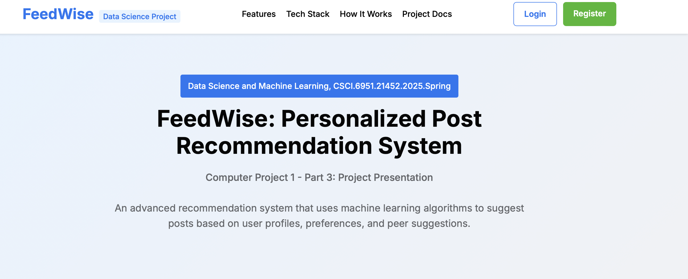

# FeedWise



**Personalized Post Recommendation System**

## 🌟 Overview

FeedWise is an advanced recommendation system that leverages machine learning algorithms to suggest posts based on user profiles, preferences, and peer suggestions. Developed as part of CSCI.6951.21452.2025.Spring (Data Science and Machine Learning), this project demonstrates the practical application of KNN algorithm and similarity matching techniques to enhance content discovery.

## ✨ Key Features

- **Personalized Recommendations** - Content suggestions tailored to unique user profiles using advanced similarity matching algorithms
- **Peer-Based Suggestions** - Discover posts that similar users found valuable through collective intelligence
- **KNN Algorithm** - Utilizes K-Nearest Neighbors to find and recommend the most relevant content based on multiple similarity factors
- **Dynamic Learning** - Improves over time by learning from user interactions and continuously refining its recommendation model
- **Tag-Based Matching** - Sophisticated tag matching ensures content discovery that aligns with user interests and professional skills
- **Weighted Scoring System** - Balanced approach that prioritizes different aspects of content relevance for better recommendations

## 🧠 How It Works

### KNN Algorithm & Similarity Matching

The K-Nearest Neighbors (KNN) algorithm powers our recommendation system:

1. **Profile Vectorization** - User profiles and post content are converted into numerical vectors
2. **Similarity Calculation** - Mathematical methods (like cosine similarity) measure profile similarities
3. **Nearest Neighbors** - For each user, we identify the "K" most similar users based on profile data
4. **Content Matching** - We recommend posts that these similar users engaged with positively

### Weighted Scoring System

Our system directly matches user skills and preferences with post tags, using different weights:

- **Skills matches**: 5 points per match
- **Preferences matches**: 5 points per match
- **Interaction-based matches**: 3 points per match

This ensures recommendations are relevant to both professional profiles and personal interests.

## 📊 Implementation Details

### Core Algorithm Approach

- Implemented a tag-matching recommendation system prioritizing direct matches between user profiles and post content
- The algorithm extracts and normalizes user skills and preferences, matches these against normalized post tags, and scores posts based on matches
- Additional scoring for posts with tags similar to previously liked content ensures a balanced mix of recommendations

### Libraries Used

```python
from sklearn.neighbors import NearestNeighbors
from sklearn.preprocessing import MultiLabelBinarizer
import numpy as np
import pandas as pd
import matplotlib.pyplot as plt
```

## 📖 Project Documentation

This project was developed as part of CSCI 6951: Data Science and Machine Learning. The complete project documentation covers:

- Project plan and objectives
- Methodology and implementation details
- Data collection and preprocessing
- Algorithm design and optimization
- Evaluation metrics and results
- Challenges and mitigation strategies

## 👨‍💻 Author

**Sundar Raj Sharma**
- Email: ssharma33@student.ysu.edu
- Institution: University Research Lab, Computer Science Department

## 📝 License

This project is licensed under the MIT License - see the [LICENSE](LICENSE) file for details.

---
© 2025 FeedWise - Academic Project | Created by Sundar Raj Sharma